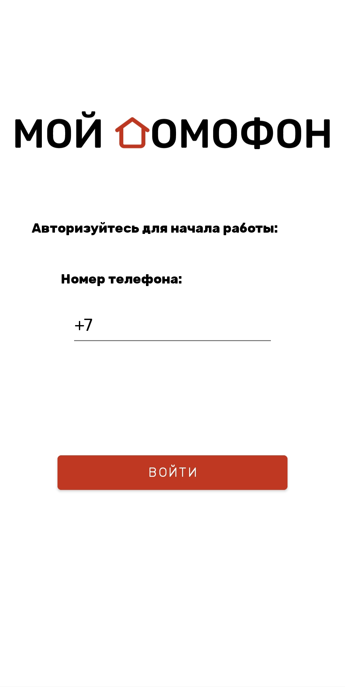
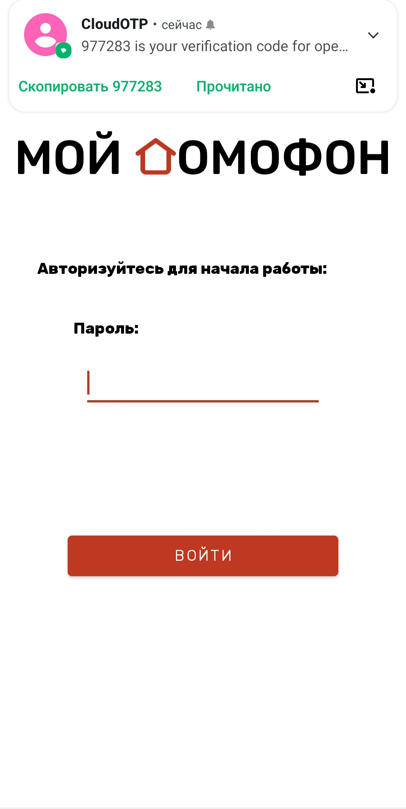

<h1>Мой домофон</h1>

 

Мобильное приложениt для удаленного управления домофоном.

<h2>Описание</h2>

**Функционал приложения:**

- lистанционное управление дверью домофона;
- приема видео звонка через приложение;
- дистанционное видение диалога со звонящим в дверь из любой точки мира;
- бесконтактное открытие при приближении пользователя к двери.
  
 

    
    
    

<h2>FAQ</h2>

**В случае возникновении ошибки создания local/properties**

- Выполниете следующие действия:

1. В меню File -> project Structure
2. Cлева -> SDK Location
3. Выберите расположение Sdk (по умолчанию C:\Users\\**YourUser**\AppData\Local\Android\Sdk)
4. Нажмите OK или Apply 
